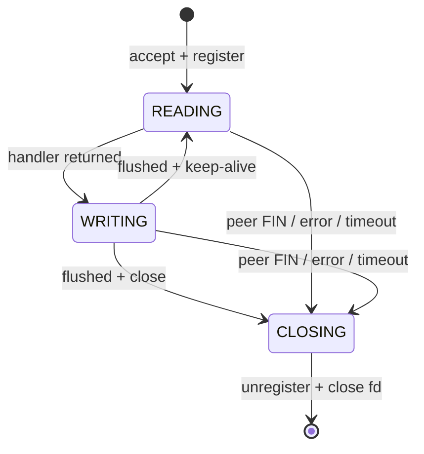
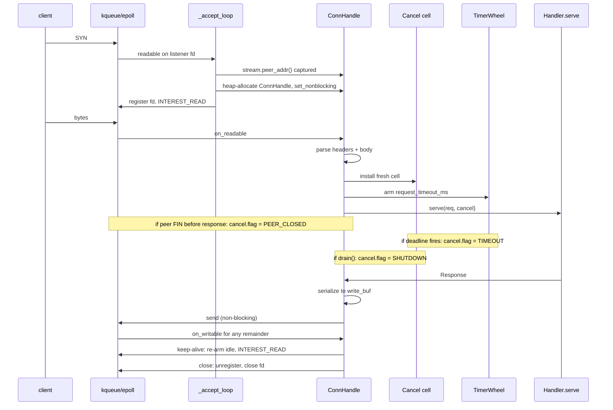
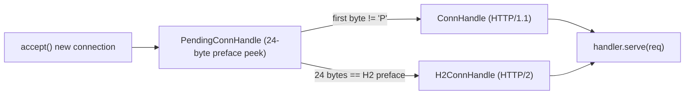

# Architecture

flare is a layered library. Each module imports only from the layers
below it. No circular dependencies, no global state, no hidden runtime.

```
flare.io       BufReader (Readable trait, generic buffered reader)
flare.ws       WebSocket client + server (RFC 6455). Multi-worker
               server via WsServer.serve(handler, num_workers=N)
               on a SO_REUSEPORT-shared port. WsClient.connect
               advertises ALPN ["http/1.1"] on wss:// to lock in
               the existing Upgrade-based path. RFC 8441
               WebSocket-over-HTTP/2 (Extended CONNECT,
               :protocol=websocket): server-side capture in
               flare.http2 + WsOverH2Stream client-side
               adapter that bridges DATA frames to/from
               WsFrame. RFC 7692 permessage-deflate codec
               (no_context_takeover by default, per-message
               cap to bound zip-bomb risk).
flare.http2    Low-level HTTP/2 byte drivers (RFC 9113 +
               RFC 7541): Frame codec, HPACK enc/dec (incl.
               H=1 Huffman literals + SIMD-shim decoder),
               stream + connection state machines,
               H2Connection (server byte driver),
               Http2ClientConnection (client byte driver,
               with SETTINGS_ENABLE_CONNECT_PROTOCOL +
               send_extended_connect for WS-over-h2),
               h2c upgrade detection (preface peek + Upgrade
               dance), per-stream RST_STREAM Cancel
               propagation, ALPN dispatch helper.
flare.http     HTTP/1.1 client + reactor server + Handler / Router / App
               + extractors (incl. Form / Multipart / Cookies)
               + ComptimeRouter + StaticResponse + Cancel / CancelHandler
               + middleware stack (Logger / RequestId / Compress / CatchPanic)
               + Cors + FileServer (with HEAD + Range)
               + content-encoding (gzip + brotli)
               + signed cookies + typed Session[T] stores
               + HTTP/1.1 trailers (parse + emit) + multi-listener
               HttpServer.bind_many + HttpClient.with_pool
               connection pool + h2c-via-Upgrade client.
               Router is Copyable (refcounted struct-handler list)
               and resolves the multi-worker overload directly.
flare.crypto   HMAC-SHA256, base64url codec
flare.tls      TLS 1.2/1.3 (OpenSSL); TlsAcceptor + ALPN +
               session resumption (RFC 5077 tickets / RFC 8446
               §4.6.1 NewSessionTicket capture and replay).
flare.tcp      TcpStream + TcpListener (IPv4 + IPv6)
flare.udp      UdpSocket (IPv4 + IPv6)
flare.uds      UnixListener + UnixStream (AF_UNIX sidecar IPC)
flare.dns      getaddrinfo (dual-stack)
flare.net      IpAddr, SocketAddr, RawSocket
flare.runtime  Reactor (kqueue/epoll + EPOLLEXCLUSIVE), TimerWheel,
               Scheduler, HandoffQueue + WorkerHandoffPool,
               num_cpus / default_worker_count, pthread + pinning,
               install_drain_on_sigterm
flare.testing  fork-and-serve helpers (`fork_server` /
               `kill_forked_server`) for cookbook examples and
               integration tests that need a real bound port
               in a child process.
flare.utils    POSIX FFI thunks (`fork` / `waitpid` / `kill` /
               `usleep` / `exit` / `getpid` + SIGKILL / SIGTERM /
               SIGINT) the Mojo stdlib doesn't expose yet.
               Cross-cutting layer: pulled by tests, examples,
               and `flare.testing` so each call site stops
               re-declaring the same `external_call` thunks.
```

---

## Reactor + per-connection state machine

A single event loop per worker drives every connection. No
thread-per-connection. No locks on the hot path. The reactor wraps
`kqueue` on macOS and `epoll` on Linux through a thin abstraction
in [`flare/runtime/reactor.mojo`](../flare/runtime/reactor.mojo).

Each accepted connection owns a small state machine in
[`flare/http/_server_reactor_impl.mojo`](../flare/http/_server_reactor_impl.mojo):



The state machine **does not own** the reactor or the timer wheel. It
exposes `on_readable`, `on_writable`, and `on_timeout` and returns a
small `StepResult` per call telling the reactor how to update its
interest mask, whether to re-arm the idle timer, and whether the
connection is finished. The reactor owns the lifecycle.

A 3-cycle inline fast path in `run_reactor_loop` lets a single
readable event drive the next writable + the next readable in
sequence (without going back through `kqueue.kevent` / `epoll_wait`)
when the buffers permit. This is the single biggest win on the
plaintext keep-alive workload — the syscall overhead is the
dominant per-request cost on flare's hot path.

---

## Request lifecycle



The Cancel cell is a single byte (`0` = live, `1..3` = reason) that
the reactor flips before the handler's next `cancel.cancelled()` poll.
We do not preempt — Mojo can't, and synchronous preemption would
defeat the per-thread invariant. Cooperation is the contract.

---

## Multicore: thread-per-core, two listener modes

`HttpServer.serve(handler, num_workers=N)` with `N >= 2` runs N
pthread workers via `Scheduler`. Each worker owns its own reactor,
its own timer wheel, its own per-connection state.
**Shared-nothing.** Two listener strategies are supported:

- **Default — per-worker `SO_REUSEPORT` listeners.** The
  Scheduler pre-binds one `SO_REUSEPORT` listener per worker on
  its own thread (serialised binds avoid concurrent-bind races)
  and hands each worker its own fd. The kernel hashes new
  4-tuples to one of N listeners, matching `actix_web`'s
  default shape. Highest steady-state throughput on dev-box
  workloads -- this is what the published p99 / p99.99 numbers
  in [`docs/benchmark.md`](benchmark.md) measure. The io_uring
  buffer-ring path (`FLARE_BUFRING_HANDLER=1`) uses per-worker
  `SO_REUSEPORT` unconditionally because io_uring's multishot
  accept attaches to a single fd per ring.
- **Opt-out — shared listener with `EPOLLEXCLUSIVE`
  (`FLARE_REUSEPORT_WORKERS=0`).** One listener fd is bound
  via `bind_shared` and borrowed by every worker, registered
  with `Reactor.register_exclusive` so the kernel wakes one
  worker per accept event (Linux >= 4.5; macOS degrades to
  plain `register`). Idle workers absorb spikes; busy workers
  aren't burdened with extra accepts. Trades 7–22 % req/s
  (handler vs static fast path) for a uniformly tighter p99.99
  σ across both paths under sustained load — see
  [`docs/benchmark.md`](benchmark.md#listener-mode-ab-flare-only)
  for the head-to-head numbers.

`pin_cores=True` (default) pins worker `i` to core `i % num_cpus()`
on Linux via `pthread_setaffinity_np`. macOS does not expose CPU
affinity to userspace, so pinning is a no-op there. The upper
bound on `num_workers` is 256, enforced by `Scheduler.start`.

`Scheduler.shutdown` and `Scheduler.drain(timeout_ms)` coordinate
across workers. Drain returns one `ShutdownReport` per worker.

---

## HTTP/2: one server, one client, version-aware

There is no separate `Http2Server` / `Http2Client` to learn.
`flare.http.HttpServer` and `flare.http.HttpClient` are HTTP-
version-aware internally:

- `HttpServer.serve(handler, num_workers=N)` runs a unified
  reactor loop ([`flare/http/_unified_reactor_impl.mojo`](../flare/http/_unified_reactor_impl.mojo))
  that auto-dispatches every accepted connection to either
  the existing HTTP/1.1 `ConnHandle` or the new HTTP/2
  `H2ConnHandle` based on the first 24 bytes (RFC 9113 §3.4
  client connection preface). The same handler is invoked
  for both wires.
- `HttpClient` advertises ALPN `["h2", "http/1.1"]` on every
  TLS ClientHello and dispatches internally based on what
  the server selected; if the server picks `http/1.1` (or
  doesn't speak ALPN at all) the existing HTTP/1.1 wire is
  used. For cleartext `http://` URLs the default is HTTP/1.1;
  pass `prefer_h2c=True` to force HTTP/2 cleartext via prior
  knowledge.

Per-connection state machines:



Both terminal handles run in the same reactor (`epoll` /
`kqueue`), share the same accept-fairness story
(`EPOLLEXCLUSIVE` shared listener vs per-worker `SO_REUSEPORT`
based on `FLARE_REUSEPORT_WORKERS`), and produce the same
`flare.http.Response` -- so the entire application surface
(`Router`, `App[S]`, every middleware, every typed extractor,
`Cancel`, `Session[T]`, `FileServer`, content negotiation,
structured logging, Prometheus metrics, auth extractors,
`CsrfToken`, templates) works identically on both wires.

Low-level driver primitives stay public in `flare.http2` for
callers who want to roll their own dispatch loop:
`H2Connection`, `Http2ClientConnection`, `Http2Config`,
`Http2ClientConfig`, `HpackEncoder`, `HpackDecoder`, the frame
codec, and the helpers `is_h2_alpn` / `detect_h2c_upgrade`.

What *doesn't* port automatically (RFC 9113 §8.2.2):

- **Connection-level headers** (`Connection`, `Keep-Alive`,
  `Transfer-Encoding`, `Proxy-Connection`, `Upgrade`) -- the
  HttpClient h2 path strips these before encoding HEADERS;
  the H2Connection server-side does the same.
- **WebSocket-over-HTTP/2** (RFC 8441 Extended CONNECT) is
  wired through the same `WsClient.connect(url)` /
  `WsServer.serve(handler)` surface (negotiated automatically
  via ALPN); HTTP/1.1 Upgrade stays the fallback path. See
  [`flare/ws/`](../flare/ws/) for the bridge.

### API surface parity

End-state: the public client + server APIs are unified, so
there is no parity table any more -- one type, one shape:

| Surface | Type |
|---|---|
| HTTP server (HTTP/1.1 + HTTP/2 via auto-dispatch) | [`flare.http.HttpServer`](../flare/http/server.mojo) |
| HTTP client (HTTP/1.1 + HTTP/2 via TLS+ALPN or `prefer_h2c=True`) | [`flare.http.HttpClient`](../flare/http/client.mojo) |
| WebSocket server (HTTP/1.1 Upgrade today; RFC 8441 over h2 wired on the byte driver, tunnel adapter is a follow-up) | [`flare.ws.WsServer`](../flare/ws/server.mojo) |
| WebSocket server (multi-worker via SO_REUSEPORT) | `flare.ws.WsServer.serve(handler, num_workers=N)` |
| WebSocket client (`ws://` / `wss://` -- HTTP/1.1 Upgrade today; ALPN advertises `http/1.1` on wss:// to lock in the existing path) | [`flare.ws.WsClient`](../flare/ws/client.mojo) |
| Low-level HTTP/2 byte driver (server) | [`flare.http2.H2Connection`](../flare/http2/server.mojo) |
| Low-level HTTP/2 byte driver (client) | [`flare.http2.Http2ClientConnection`](../flare/http2/client.mojo) |

---

## Timer wheel

[`flare/runtime/timer_wheel.mojo`](../flare/runtime/timer_wheel.mojo)
is a hashed timing wheel with millisecond resolution and a fixed
slot count. Inserts and cancels are O(1) amortised; `advance(now_ms)`
fires every expired entry in slot order. It's the single source of
truth for `idle_timeout_ms`, `write_timeout_ms`,
`read_body_timeout_ms`, `handler_timeout_ms`, and
`request_timeout_ms`.

Resolution: 1 ms tick, 1024 slots, fixed memory. Deadlines below
1 ms round up. This is well below the noise floor of any HTTP
deadline a real service cares about.

---

## What stays out of the reactor

flare deliberately keeps a few things on the application thread, not
the reactor thread:

- **TLS handshake.** Client handshake is inline on
  `TlsStream.connect`. The server-side `TlsAcceptor` exposes a
  blocking `handshake_fd(fd)` today; the non-blocking
  reactor-state-machine variant (advanced via the same
  `on_readable` / `on_writable` calls as HTTP) is a follow-up
  gated on a Mojo nightly improvement.
- **DNS resolution.** `getaddrinfo` is a blocking call; the
  client uses it pre-connect. The reactor never blocks on it.
- **Long-running handler work.** The contract is synchronous: a
  slow handler blocks its worker's reactor. The `Cancel` token
  ensures the *caller* doesn't pay for it (peer FIN, timeout,
  drain all flip the cell); the `block_in_pool` escape hatch is
  the documented way to push work off the reactor thread when a
  blocking call is unavoidable.

---

## Where to read the code

| Concern | Source |
|---|---|
| Reactor abstraction | [`flare/runtime/reactor.mojo`](../flare/runtime/reactor.mojo) |
| `kqueue` impl | [`flare/runtime/_kqueue.mojo`](../flare/runtime/_kqueue.mojo) |
| `epoll` impl | [`flare/runtime/_epoll.mojo`](../flare/runtime/_epoll.mojo) |
| Timer wheel | [`flare/runtime/timer_wheel.mojo`](../flare/runtime/timer_wheel.mojo) |
| Multicore scheduler | [`flare/runtime/scheduler.mojo`](../flare/runtime/scheduler.mojo) |
| HTTP request parsing | [`flare/http/server.mojo`](../flare/http/server.mojo) |
| HTTP per-conn state machine | [`flare/http/_server_reactor_impl.mojo`](../flare/http/_server_reactor_impl.mojo) |
| `Cancel` cell + `CancelHandler` | [`flare/http/cancel.mojo`](../flare/http/cancel.mojo) |
| Server-side TLS | [`flare/tls/acceptor.mojo`](../flare/tls/acceptor.mojo) |
| Streaming response bodies | [`flare/http/streaming.mojo`](../flare/http/streaming.mojo) |
| SIGTERM helper | [`flare/runtime/_signal.mojo`](../flare/runtime/_signal.mojo) |

If you want a one-page tour of each, the layered docstrings on the
public types (`HttpServer`, `Router`, `Handler`, `App`) are the place
to start; they include "Failure modes" sections describing what
raises, what becomes a 4xx vs 5xx, what gets logged, and what never
returns.
